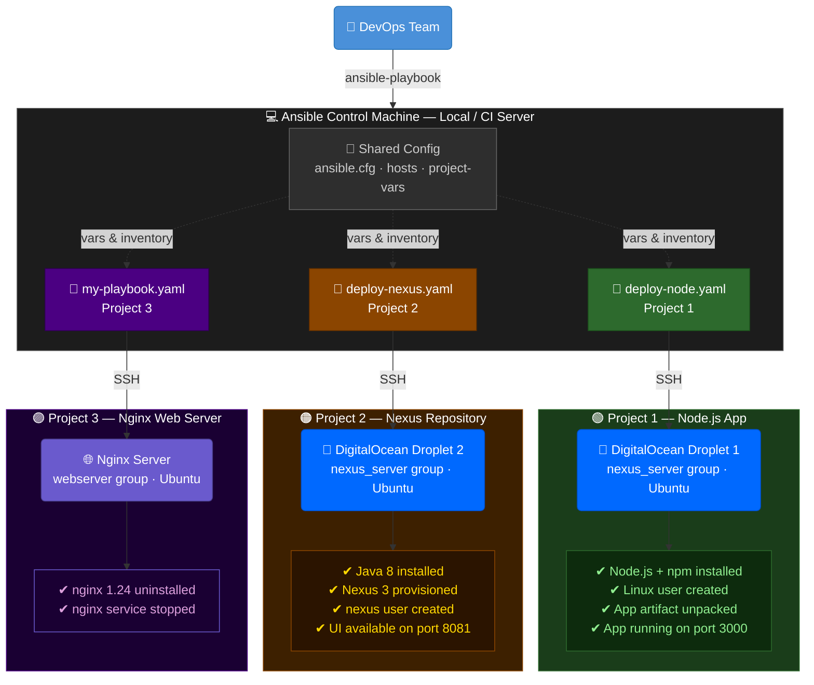

# nodejs-app — Ansible Configuration Management Projects

A collection of three independent Ansible configuration management projects sharing a common control plane. Each project targets a separate server and demonstrates a distinct aspect of infrastructure automation using Ansible.

---

## Table of Contents

1. [Architecture Overview](#architecture-overview)
2. [Shared Infrastructure](#shared-infrastructure)
3. [Project 1 — Deploy Node.js Application](#project-1--deploy-nodejs-application)
4. [Project 2 — Provision Sonatype Nexus Repository](#project-2--provision-sonatype-nexus-repository)
5. [Project 3 — Configure Nginx Web Server](#project-3--configure-nginx-web-server)
6. [Project Structure](#project-structure)
7. [Prerequisites](#prerequisites)
8. [Step 1 — Provision Infrastructure](#step-1--provision-infrastructure)
9. [Step 2 — Configure Shared Ansible Files](#step-2--configure-shared-ansible-files)
10. [Step 3 — Run the Playbooks](#step-3--run-the-playbooks)
11. [Application](#application)

---

## Architecture Overview



---

## Shared Infrastructure

All three projects share the following Ansible configuration files:

| File            | Purpose                                                        |
|-----------------|----------------------------------------------------------------|
| `ansible.cfg`   | Disables host key checking for automated runs                  |
| `hosts`         | Static inventory defining the `nexus_server` group — used by both `deploy-node.yaml` and `deploy-nexus.yaml` |
| `project-vars`  | Shared variables — app version, paths, Linux username          |

### ansible/ansible.cfg

```ini
[defaults]
host_key_checking = False
```

### ansible/hosts

```ini
[nexus_server]
<DROPLET_IP> ansible_ssh_private_key_file=~/.ssh/id_rsa ansible_python_interpreter=/usr/bin/python3 ansible_user=root
```

### ansible/project-vars

```yaml
version: 1.0.0
location: <absolute-path-to-nodejs-app-directory>
linux_name: <your-linux-username>
user_home_dir: /home/{{linux_name}}
```

---

## Project 1 — Deploy Node.js Application

**Playbook:** `ansible/deploy-node.yaml`
**Target:** `nexus_server` inventory group (`ansible/hosts`)
**Purpose:** Installs Node.js and npm, creates a dedicated Linux user, unpacks the application artifact, installs dependencies, and starts the server.

### What it does

| Play | Tasks |
|------|-------|
| Install node and npm | Updates apt cache, installs `nodejs` and `npm` |
| Create Linux user | Creates user `ndu` in the `admin` group |
| Deploy nodejs app | Unpacks `.tgz` artifact, runs `npm install`, starts app with `node server`, verifies process is running |

### Run

```bash
ansible-playbook ansible/deploy-node.yaml
```

### Expected outcome

The Node.js application starts on **port 3000** and responds with:

```
Hello TWN students!
```

The playbook verifies the process is running automatically — the final task runs `ps aux | grep node` and prints the result to the Ansible output.

To manually confirm after the playbook completes:

```bash
ssh root@<NODE_SERVER_IP>
ps aux | grep node
```

---

## Project 2 — Provision Sonatype Nexus Repository

**Playbook:** `ansible/deploy-nexus.yaml`
**Target:** `nexus_server` inventory group (`ansible/hosts`)
**Purpose:** Fully provisions a Sonatype Nexus 3 artifact repository from scratch on a clean Ubuntu server.

### What it does

| Play | Tasks |
|------|-------|
| Install Java and net-tools | Updates apt, installs `openjdk-8-jre-headless` and `net-tools` |
| Download and unpack Nexus | Downloads latest Nexus `.tar.gz` from Sonatype, extracts to `/opt/`, renames folder to `/opt/nexus` |
| Create nexus user | Creates `nexus` group and user, sets ownership of `/opt/nexus` and `/opt/sonatype-work` |
| Start Nexus | Configures `run_as_user=nexus` in `nexus.rc`, starts Nexus service |
| Verify Nexus running | Checks process with `ps aux`, waits 1 minute for startup, verifies port with `netstat` |

### Run

```bash
ansible-playbook ansible/deploy-nexus.yaml
```

### Expected outcome

Nexus Repository Manager starts on **port 8081**:

```
http://<NEXUS_SERVER_IP>:8081
```

The playbook verifies Nexus automatically — it checks the process with `ps aux`, waits for startup, then confirms the port is listening with `netstat`. Results are printed to the Ansible output.

To manually confirm after the playbook completes:

```bash
ssh root@<NEXUS_SERVER_IP>
ps aux | grep nexus
netstat -plnt
```

> **Note:** `nexus.sh` in the `ansible/` directory is the manual shell script equivalent of `deploy-nexus.yaml` — it was used to understand the setup steps before they were automated into the playbook.

---

## Project 3 — Configure Nginx Web Server

**Playbook:** `ansible/my-playbook.yaml`
**Target:** `webserver` host group
**Purpose:** Manages the nginx service state — uninstalls a specific version and stops the service.

### What it does

| Play | Tasks |
|------|-------|
| Configure nginx web server | Uninstalls `nginx=1.24*`, stops the nginx service |

### Run

```bash
ansible-playbook ansible/my-playbook.yaml
```

> Ensure the `webserver` group is defined in the `hosts` file before running this playbook.

### nginx default page (before playbook run)


---

## Project Structure

```
nodejs-app/
├── ansible/
│   ├── ansible.cfg          # Shared: connection settings
│   ├── hosts                # Shared: static inventory (nexus_server group)
│   ├── project-vars         # Shared: variables for all playbooks
│   ├── deploy-node.yaml     # Project 1: Node.js app deployment
│   ├── deploy-nexus.yaml    # Project 2: Nexus repository provisioning
│   ├── my-playbook.yaml     # Project 3: Nginx web server config
│   └── nexus.sh             # Manual reference script (pre-automation)
├── app/
│   └── server.js            # Express.js application
├── package/                 # Extracted artifact (from nodejs-app-1.0.0.tgz)
│   ├── app/
│   ├── Dockerfile
│   └── package.json
├── Dockerfile               # Docker image definition
├── package.json             # Node.js dependencies
└── nodejs-app-1.0.0.tgz    # Packaged application artifact
```

---

## Prerequisites

### Ansible Control Machine

- Ansible installed (`ansible --version`)
- SSH access to both DigitalOcean Droplets via `~/.ssh/id_rsa`
- Python 3 available on target servers

### DigitalOcean Droplets

| Droplet | Group           | OS     | Used By |
|---------|-----------------|--------|---------|
| Droplet 1 | `nexus_server` | Ubuntu | Node.js app (`deploy-node.yaml`) |
| Droplet 2 | `nexus_server` | Ubuntu | Nexus server (`deploy-nexus.yaml`) |

> Both playbooks resolve their target host via the `nexus_server` group in `ansible/hosts`. Update the IP in `hosts` to match the server you are targeting before running each playbook.

### Target Server Requirements

| Project | Requirements |
|---------|-------------|
| deploy-node.yaml | Ubuntu, SSH access as root, `python3` available |
| deploy-nexus.yaml | Ubuntu, min 4GB RAM recommended for Nexus, port 8081 open |
| my-playbook.yaml | Ubuntu with nginx installed, `webserver` group in hosts |

---

## Step 1 — Provision Infrastructure

### 1.1 Create DigitalOcean Droplet 1 (Node.js Server)

1. Log into DigitalOcean and create a new **Droplet**:
   - OS: **Ubuntu 22.04 LTS**
   - Plan: Basic (minimum 1GB RAM)
   - Authentication: SSH Key (`~/.ssh/id_rsa.pub`)
2. Note the public IP — update `ansible/hosts` under `[nexus_server]` with this IP before running `deploy-node.yaml`.

### 1.2 Create DigitalOcean Droplet 2 (Nexus Server)

1. Create a second **Droplet**:
   - OS: **Ubuntu 22.04 LTS**
   - Plan: Basic (**minimum 4GB RAM** — Nexus requires it)
   - Authentication: SSH Key (`~/.ssh/id_rsa.pub`)
2. Update `ansible/hosts` with the Droplet's public IP under `[nexus_server]`.

---

## Step 2 — Configure Shared Ansible Files

### 2.1 Update the inventory

Both `deploy-node.yaml` and `deploy-nexus.yaml` resolve their target through the `nexus_server` group in `ansible/hosts`. Before running each playbook, set the IP in `[nexus_server]` to match the server you are targeting:

```ini
[nexus_server]
<TARGET_SERVER_IP> ansible_ssh_private_key_file=~/.ssh/id_rsa ansible_python_interpreter=/usr/bin/python3 ansible_user=root
```

Replace `<TARGET_SERVER_IP>` with Droplet 1's IP when deploying the Node.js app, or Droplet 2's IP when provisioning Nexus.

### 2.2 Update project-vars

Edit `ansible/project-vars` to match your environment:

```yaml
version: 1.0.0
location: <absolute-path-to-nodejs-app-directory>
linux_name: <your-linux-username>
user_home_dir: /home/{{linux_name}}
```

### 2.3 Package the application artifact

From the project root, package the app before deploying:

```bash
npm pack
```

This produces `nodejs-app-1.0.0.tgz` — the artifact that `deploy-node.yaml` copies and unpacks on the remote server.

---

## Step 3 — Run the Playbooks

Run each playbook independently from the project root:

```bash
# Project 1 — Deploy Node.js app to Droplet 1
ansible-playbook ansible/deploy-node.yaml

# Project 2 — Provision Nexus on Droplet 2
ansible-playbook ansible/deploy-nexus.yaml

# Project 3 — Configure Nginx (ensure webserver group is set in hosts)
ansible-playbook ansible/my-playbook.yaml
```

---

## Application

The Node.js application is a minimal **Express.js** web server:

- **Framework:** Express.js
- **Logging:** Pino (structured JSON logs)
- **Port:** `3000`
- **Response:** `Hello TWN students!`

### Run locally

```bash
npm install
npm start
```

### Build Docker image

```bash
docker build -t node-app .
```

### Run in Docker

```bash
docker run -p 3000:3000 node-app
```

Access at `http://localhost:3000`
